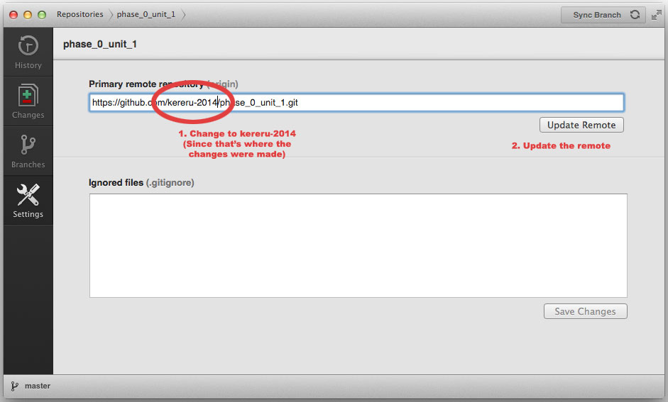
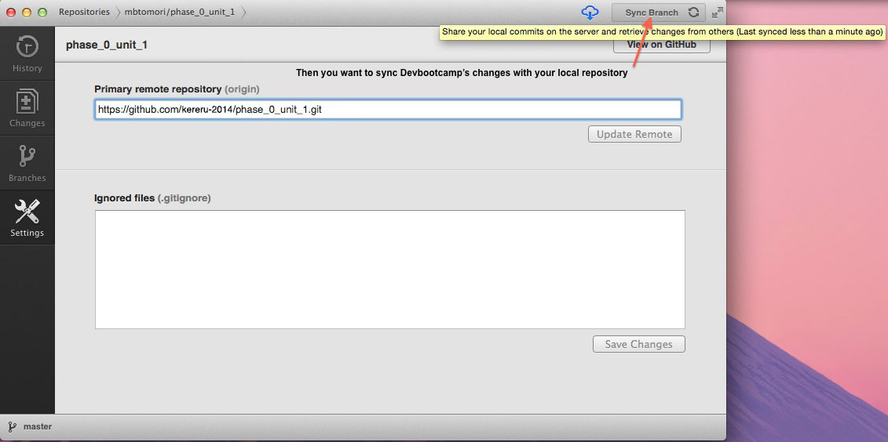
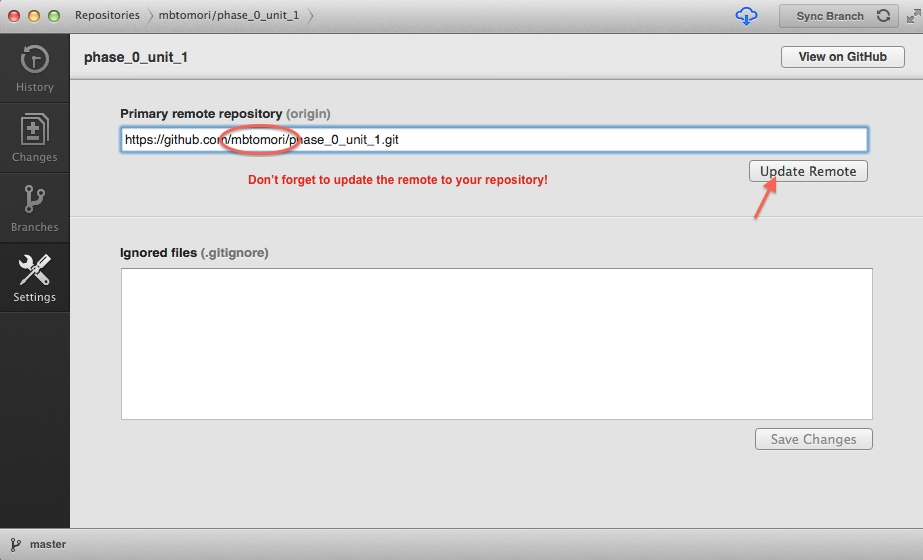

[Table of Contents](readme.md)

# How to Fetch Dev Academy's Curriculum Changes 

Dev Academy makes modifications and edits to the curriculum often. When this happens you'll need to "fetch" the changes from Github.com into your personal repository. This can be confusing to do, so thankfully, we've created this handy guide for you to do it via the command line or GitHub app.

It's important to note that **fetching changes will NOT override your work.** On the rare occasion we do modify a 'my_solution' file, you may have a merge conflict, All you'll have to do is select which parts you want. This is not likely to happen, so don't worry about it much. 

Navigate to the appropriate directory in your terminal. Make sure you are in the **master branch** of the repo you want to update (`phase_0_unit_1`, `phase_0_unit_2`, or `phase_0_unit_3`. Check this by running `git branch` in your terminal. DO NOT try fetching changes into a different repo (than the one you want to update) or your [USERNAME].github.io repo. You will mess things up!


## Using the Command Line 
*For Windows, Linux, and OSX. For week 1 and 2, if you are an OS user, you can use the app instructions below. Starting in week 3, everyone should use the command line.*
*(Adapted from [Github](https://help.github.com/articles/syncing-a-fork)).*

**Note: Syncing your fork only updates your local copy of the repository; it does not update your repository on GitHub.**

### Setting up a new remote (link to a repository hosted on github.com)
*You'll only need to do set up a remote once!*

####1. Check your current remote. This should link to your personal fork. 

```shell
$ git remote -v
# List the current remotes
# origin  https://github.com/[your_username_here]/repo.git (fetch)  #This will either have https or ssh url
# origin  https://github.com/[your_username_here]/repo.git (push)

```

####2. Set up a new remote

```shell
$ git remote add upstream https://github.com/weka-2014/phase_0_unit_1.git 
# You are adding EDA's repository saying you want to be able to fetch (grab changes) from it.

```

3. Verify your new remote

```shell
origin    https://github.com/[your_username_here]/repo.git (fetch)
# origin    https://github.com/[your_username_here]/repo.git (push)
# upstream  https://github.com/weka-2014/phase_0_unit_1.git (fetch)
# upstream  https://github.com/weka-2014/phase_0_unit_1.git (push) # You do not want to push to this repository!
```

### Syncing
You have a couple of steps to add changes from EDA's repository. 

####1. Fetch the Changes
Fetching from EDA's remote repository will bring in EDA's changes into a special branch in your local repository. **Note: it's not merged yet**

```shell
$ git fetch upstream
# Grab the upstream remote's branches
# remote: Counting objects: 75, done.
# remote: Compressing objects: 100% (53/53), done.
# remote: Total 62 (delta 27), reused 44 (delta 9)
# Unpacking objects: 100% (62/62), done.
# From https://github.com/weka-2014/phase_0_unit_1
#  * [new branch]      master     -> upstream/master

```

Now the upstream's master branch is stored on your local branch, `upstream/master`

```shell
$ git branch -va
# List all local and remote-tracking branches
# * master                  a422352 My local commit
#   remotes/origin/HEAD     -> origin/master
#   remotes/origin/master   a422352 My local commit
#   remotes/upstream/master 5fdff0f EDA's latest commit

```

###2. Merge the changes
Now that you have EDA's changes stored in your local repository, you need to merge the changes with yours. 

First make sure you are on your master branch. 

```shell
$ git branch
* master

#OR

$ git checkout master
# checks out to your master branch
```

Then merge the changes.This will bring your master branch into sync with EDA's master branch - and you won't lose your local changes. 

```shell
$ git merge upstream/master
# Merges upstream's master into your local forked repository
```

If you did not have any un-synced commits, git will perform a "fast-forward". 

###3. Commit and sync your new local repository with your remote fork on github.com

```shell
$ git commit -m "added EDA's changes"

$ git push origin master
# origin refers to your local repository
# master refers to the master branch on your github.com forked repository

```

###4. Check github.com!
Look at your master branch on github.com. It should have your forked changes!

## Using the Github App (OS only)
*If you're using windows/linux, you'll need to look at the terminal instructions*

####1. Go to the settings tab


####2. Change the "Primary remote repository" to the upstream repo you want to use. (https://github.com/weka-2014/phase_0_unit_1)


####3. Press "Update Remote"

####4. Press "Sync Branch"


####5. Change the "Primary remote repository" back to your forked repository


####6. Press "Update Remote"

####7. You should now see the updated files in your local repository!

####8. You'll need to sync these changes with your fork to see them on Github.com!  

-----------------------------  

[Table of Contents](readme.md)
